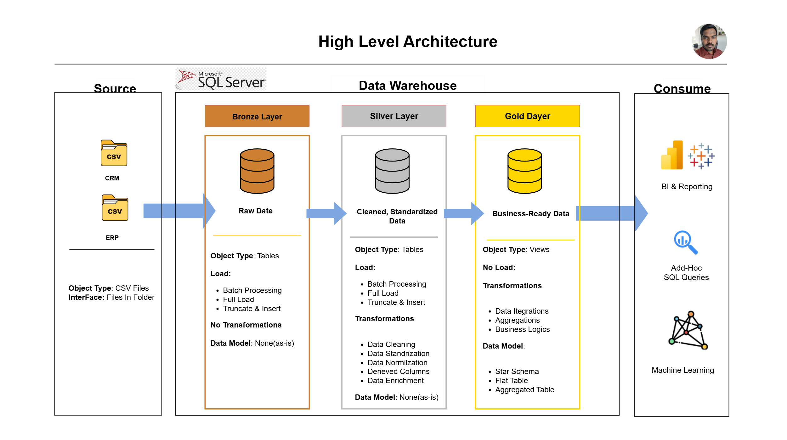

# **SQL Datawarehouse Project**
## 📌**Project Overview**
This project is a simple SQL Data Warehouse built using **Bronze, Silver, and Gold Layers**.The main idea is to take raw data from sources (like CRM/ERP CSV files), clean it, and finally create useful tables and views for reporting.

## 🏭**Data Architecture**
The data architecture for this project follows Medallion Architecture **Bronze**, **Silver**, and **Gold** Layers:


### 🥉**Bronze Layer - Raw Data**
- Stores the **raw files** exactly as they come.
- No transformations.
- Mainly used for backup and tracing the original data.
### 🥈**Silver Layer - Cleaned Data**
- Data is cleaned, standardized, and formatted. 
- Missing values, wrong formats, and inconsistent data are fixed here.
- These tables are ready for analysis but still not in business format.
### 🥇**Gold Layer - Business Layer**
- Contains **Views**, not tables.
- Combines different tables, adds logic, and creates final business-ready datasets. 
- Used for reporting, SQL queries, and dashboards.


## 🗂️ Repository Structure 
```
.
└── modern-sql-dwh-projec/
    ├── LICENSE                       # License information 
    ├── README.md                     # Project overview and instructions 
    ├── datasets/                     # Raw datasets used for the project (CRM & ERP data)
    │   ├── source_crm/             
    │   │   ├── cust_info.csv
    │   │   ├── prd_info.csv
    │   │   └── sales_details.csv
    │   └── source_erp/
    │       ├── cust_az12.csv
    │       ├── loc_a101.csv
    │       └── px_cat_g1v2.csv
    ├── docs/                         # Project  documentation  and architecture          
    │   ├── data_catalog.md
    │   ├── data_flow.png
    │   ├── data_model.png
    │   ├── data_warehouse_diagrams.drawio
    │   ├── high_level_architecture.png
    │   ├── integration_model.png
    │   └── naming_conventions.md
    ├── scripts/                      # SQL scripts for ETL and transformations
    │   ├── bronze/
    │   │   ├── ddl_bronze.sql
    │   │   └── proc_load_bronze.sql
    │   ├── gold/
    │   │   └── dd,_gold.sql
    │   ├── init_database.sql
    │   └── silver/
    │       ├── ddl_silver.sql
    │       └── proc_load_silver.sql
    └── tests/                        # Test scripts and quality files
        ├── quality_checks_gold.sql
        └── quality_checks_silver.sql
```

##☀️About Me

Hi, I'm **Shaik Munna**.  
I am developing strong skills in Data Analytics, with a focus on SQL, data cleaning, and building structured analytical datasets.  
I am committed to improving my analytical abilities and working on projects that turn data into clear, meaningful insights.


